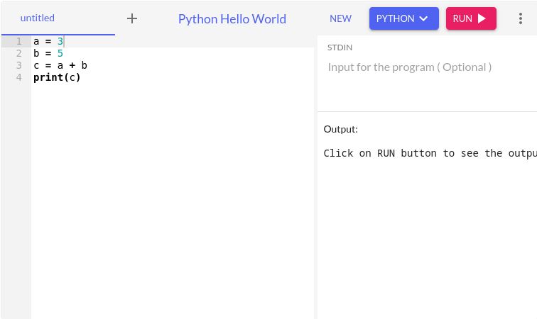
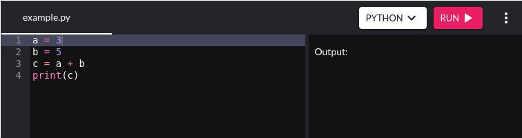

# mkdocs-onecompiler-plugin

Include [OneCompiler](https://onecompiler.com/) online compiler to your mkdocs website.

## Requirements

Works only with [`mkdocs-material`](https://squidfunk.github.io/mkdocs-material/) as it ships a [pymdownx custom fence](https://facelessuser.github.io/pymdown-extensions/extensions/superfences/#custom-fences).

## Installation

```shell
pip install mkdocs-onecompiler-plugin
```

## Configuration

Here is a minimal configuration to use the onecompiler fence

```yaml
# mkdocs.yml
theme:
  name: material

markdown_extensions:
  - attr_list
  - pymdownx.superfences:
      custom_fences:
        - name: onecompiler
          class: onecompiler
          format: !!python/name:mkdocs_onecompiler_plugin.formatter
```

## Usage

The bare minimum is to provide the language.

````md
```{.onecompiler lang="python"}
a = 3
b = 5
c = a + b
print(c)
```
````



Then we can use all the [OneCompiler API](https://onecompiler.com/cheatsheets/onecompiler-apis) to tweak the iframe.

````md
```{.onecompiler lang="python" listenToEvents=true filename="example.py" hideNew=true hideStdin=true hideNewFileOption=true hideTitle=true theme="dark" height="200px"}
a = 3
b = 5
c = a + b
print(c)
```
````



## Debug

We can access formatter parameters when `debug=true` is passed to the attributes.

````md
```{.onecompiler .test #wtfid lang="python" listenToEvents=true filename="example.py" hideNew=true hideStdin=true hideNewFileOption=true hideTitle=true theme="dark" debug=true}
a = 3
b = 5
c = a + b
print(c)
```
````

```shell
INFO    -  Building documentation...
INFO    -  Cleaning site directory
source: a = 3
b = 5
c = a + b
print(c)
language: onecompiler
css_class: onecompiler
options: {}
md: <markdown.core.Markdown object at 0x7f634a7ef910>
attrs: {'lang': 'python', 'listenToEvents': 'true', 'filename': 'example.py', 'hideNew': 'true', 'hideStdin': 'true', 'hideNewFileOption': 'true', 'hideTitle': 'true', 'theme': 'dark'}
classes: ['test']
id_value: wtfid
kwargs: {}
debug: True

<iframe id="wtfid" class="onecompiler test" frameBorder="0" src="https://onecompiler.com/embed/python?availableLanguages=true&hideLanguageSelection=false&hideNew=true&hideNewFileOption=true&disableCopyPaste=false&hideStdin=true&hideResult=false&hideTitle=true&listenToEvents=true&theme=dark" height="450px" width="100%" onload='this.contentWindow.postMessage({
        eventType: "populateCode",
        language: "python",
        files: [
            {
                "name": "example.py",
                "content": `a = 3
b = 5
c = a + b
print(c)`
            }
        ]
    }, "*");'>
</iframe>
INFO    -  Documentation built in 0.20 seconds
```
